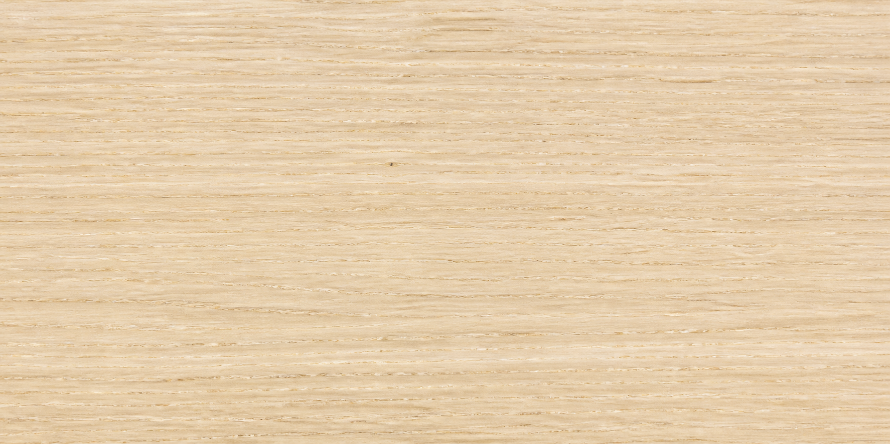
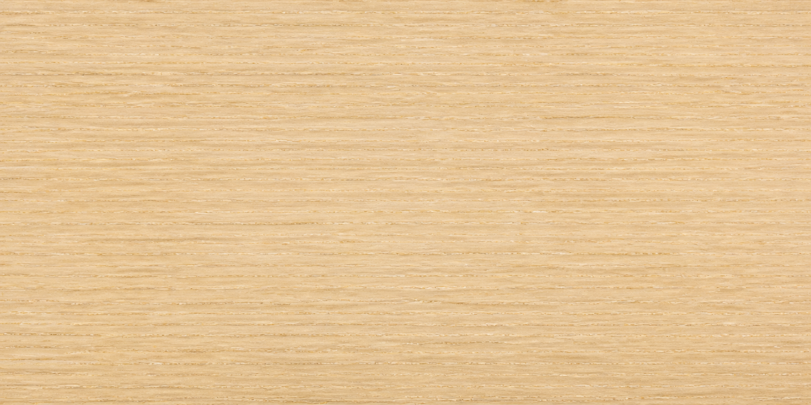
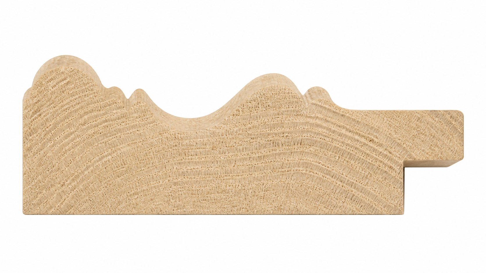

# 框料三图上传标准实例

后台创建一根框料时，固定上传 **3 张图片**，并录入一组实测参数。三张图片必须来自同一根框料，但各自承担不同作用。

## 完整示例：白蜡木复合型面

| 项目 | 示例文件 | 用途 |
| --- | --- | --- |
| 1. 正面纹理 | `ZH-ASH-080-CX-front.png` | 生成上下左右四根框条的正面颜色、木纹和微凹凸 |
| 2. 侧面纹理 | `ZH-ASH-080-CX-side.png` | 只贴到框料厚度方向，表现侧边颜色和木纹 |
| 3. 截面轮廓 | `ZH-ASH-080-CX-profile.png` | 提取圆线、凹槽、斜面、内沿等真实型面，不作为贴图 |

### 1. 正面纹理

- 镜头垂直对准框料正面，框料长边保持水平。
- 拍一段可以重复铺设的直框条，不拍完整画框和拼角。
- 使用均匀柔光，避免强反光、阴影、手指、尺子和背景进入画面。
- 图片铺满框料表面，左右两端的亮度与颜色尽量一致。

### 2. 侧面纹理

- 必须拍同一根框料的真实侧边，不能拿正面图旋转后代替。
- 与正面图在同一灯光、相机和白平衡下连续拍摄。
- 镜头垂直对准侧面，只保留侧面材质，不拍截面端头。
- 系统发布时会自动把侧面的平均亮度和白平衡匹配到正面，但拍摄差异仍应尽量小。

### 3. 截面轮廓

- 必须是真实切断后的端面，能看到横向年轮或端面纹理，而不是一张侧面照片。
- 截面朝向镜头，保持无透视、无倾斜，完整露出外沿、曲面、内沿和背部企口。
- 使用纯白或均匀浅色背景，轮廓边缘清楚；不要让尺子压住轮廓。
- 这张图只用于提取几何曲线，木纹不会贴到成品表面。

## 同时填写的实测参数

三张图之外，还必须按实物填写以下数据：

| 字段 | 白蜡木示例 | 测量含义 |
| --- | ---: | --- |
| 框料名称 | 白蜡木复合型面 | 用户看到的名称 |
| SKU | ZH-ASH-080-CX | 唯一材料编号 |
| 材质名称 | 白蜡木 | 材料分类与说明 |
| 型面类型 | 欧式曲线 | 平直、阶梯或曲线等 |
| 框宽 | 80 mm | 正面从外沿到画芯方向的总宽度 |
| 实测框深 | 30 mm | 正面到背面的真实厚度，也就是侧面高度 |
| 侧面显示宽度 | 24 mm | 斜视预览希望呈现的可见侧边参考值 |
| 内沿 | 12 mm | 靠近作品开口处的压边宽度 |
| 倒角 | 4 mm | 内外边缘的斜面尺寸 |
| 截面最大起伏 | 18 mm | 截面最高点与基准面的高度差 |
| 框料单价 | ¥268/米 | 每延米价格，不是单个画框总价 |

## 推荐文件要求

- 格式：PNG、JPG 或 WebP。
- 建议尺寸：长边 2000–4000 像素；三张图不要求相同长宽比。
- 使用原图，不加滤镜、锐化、文字、水印或透明边框。
- 文件名统一使用：`SKU-front`、`SKU-side`、`SKU-profile`。
- 尺子只用于管理员读取并填写尺寸，不依赖图片自动识别尺寸。

## 不需要上传

- 不需要上传 45° 拼角图；四角由 3D 几何生成。
- 不需要上传完整成品框照片。
- 不需要为上下左右四根框条分别上传纹理。
- 不要把截面图当作侧面贴图，也不要把正面纹理拉伸到侧面。

## 发布前检查

- [ ] 三张图来自同一根框料。
- [ ] 正面与侧面拍摄光线和白平衡一致。
- [ ] 正面图是一段可重复铺设的直框条。
- [ ] 侧面图是真实侧边，不是正面图旋转得到的。
- [ ] 截面图是真实切断端面，轮廓完整且背景干净。
- [ ] 框宽、框深、内沿、倒角和最大起伏均按实物测量。
- [ ] 单价填写为元/米。

发布后，官网会生成四向纹理、微高度图、PBR 参数和完整截面几何；微信端会读取压缩纹理、简化轮廓点和同一组物理尺寸。
