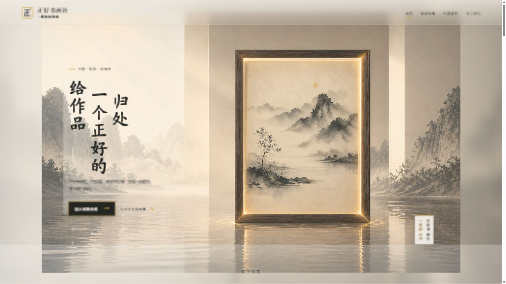
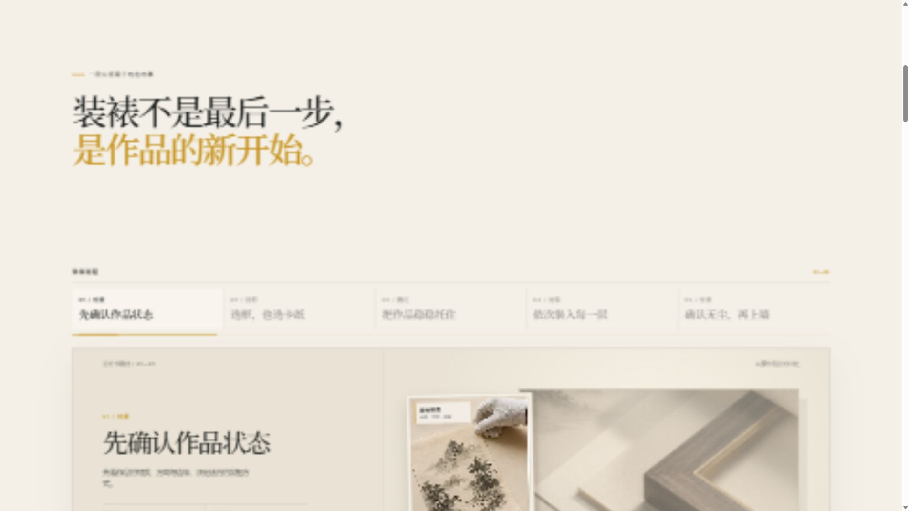
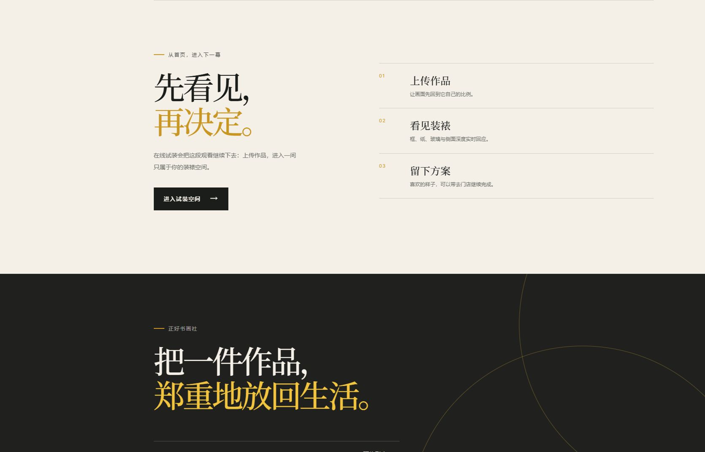

# 官网检查与性能修复

2026-09-05。范围：营销首页，不修改试装或材料后台。

## 1. 首页：保留构图和逐笔标题，绘制开销需要收敛

标题是逐笔 SVG，不是字体下载动画。原墨迹在每帧重建最多 280 个渐变，清空整屏 Canvas，再通过 multiply 混色。画布只限制 DPR，未限制总像素。鼠标还修改首页祖先上的 CSS 变量，牵动大图与水面。上述开销与全屏更卡的反馈一致，但未录制用户原浏览器的 GPU/帧率 trace，不能排除其他因素。

已改：100 万像素预算、120 粒子上限、缓存笔触、每帧合并输入、局部清屏、移除整屏混色、离开窗口/后台清理。取消鼠标驱动首页背景运动。标题 memo 化并取消 SVG 滤镜，保留原笔序与时间。

## 2. 工艺区：信息层级与滚动节奏需重新设计

标题与工作台之间距离过大，首个视口的工作台被截断。五步内容使用 500svh 长轨道，进入案例之前需要较多滚动。小尺寸浅色辅助标注的可读性有风险；这不是完整无障碍认证。建议图像主导、缩短标题与操作距离、保留五步清晰选择与具体工艺内容。

## 3. 试装介绍与品牌收尾：表达重复，缺少具体视觉内容

连续出现大标题与简短说明，试装价值主要靠文字。建议用同一作品装裱前后或材料选择的直观对照，连接实际试装入口。预约到店只锚定页脚，当前没有真实预约流程；后续设计不能虚构联系方式或预约成功。

## 验证

- npm run check:runtime 与 npm run build 通过，git diff --check 无内容错误。
- 原运行时校验失败仅由 CRLF 导致；恢复到锁定 LF 字节，未改哈希或放宽校验。
- 内置浏览器 3840×2160：墨迹画布 1333×750，10 个标题 SVG 正常；1280×800：画布 1265×791。控制台无错误，鼠标拖动后页面正常。
- 字体由 Google Fonts 远程 @import 改成站内 Noto Serif SC WOFF2 字符子集（156,580 字节，附 OFL 许可），optional 避免迟到替换；标题自身不依赖该字体。
- 未测得用户原浏览器的实际 FPS，不作帧率保证。用户认可的作品展墙逻辑没有修改。
- 已给出三个独立设计稿；等待选择后再实施视觉改版。生成图中的文案或能力描述是概念示意，落地时以实际产品为准。
